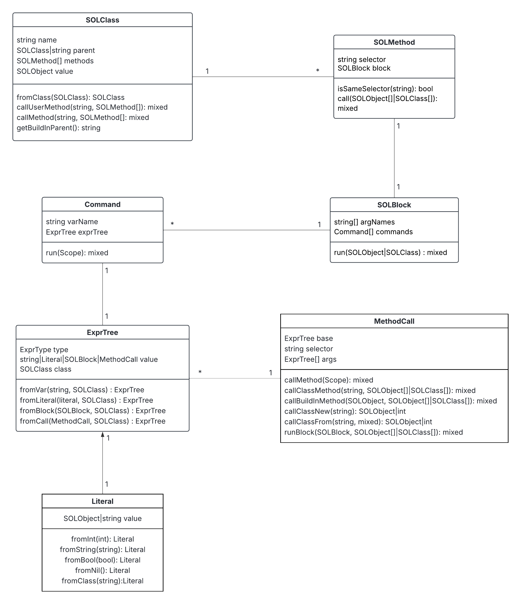

# Implementační dokumentace k %cislo%. úloze do IPP 2024/2025
### Jméno a příjmení: Martin Kratochvíl
### Login: xkratom00

---

## Struktura a myšlenka implementace

Projekt by šel rozdělit do několika logických celků, prvním je převedení zdrojového kódu v jazyce XML do vnitřních struktur, o to se stará třída Parser. Další je implementace vestavěných tříd jazyka SOL25 a nakonec samotná interpretace.

---

## Vestavěné třídy: `SOLObject`, `SOLInteger`, `SOLString`, `SOLBlock`, `SOLBool`, `SOLNil`

Třída `SOLObject` představuje základní typ, od kterého dědí všechny ostatní typy. Obsahuje sadu metod pro porovnání, identifikaci typu, práci s atributy a konverzi na řetězec.

- `SOLInteger` reprezentuje celočíselné hodnoty a podporuje aritmetické operace a převody.
- `SOLString` slouží k manipulaci s textovými řetězci. Umožňuje jejich výpis i načítání.
- `SOLBlock` reprezentuje bloky kódu, které lze vykonat později – typicky v rámci metod nebo řídicích struktur.
- `SOLBool` zastupuje třídy `True` a `False` v SOL25. Také implementuje logické operace.
- `SOLNil` reprezentuje „prázdnou“ nebo neexistující hodnotu. Umožňuje bezpečnou práci s neexistujícími objekty bez výpadků programu.

---

## Třída `SOLClass`

`SOLClass` slouží jako reprezentace uživatelsky definovaných tříd. Umožňuje uchovávat metody, pracovat s dědičností a poskytuje mechanismy pro volání metod na objektech.

Dědičnost je realizována prostřednictvím atributu `value`, který odkazuje na instanci vestavěné třídy. Volání metod probíhá v několika krocích: nejprve se hledá uživatelská metoda pomocí `callUserMethod`, která prochází hierarchii tříd, a pokud není nalezena, je pokus o dynamické volání vestavěné metody přes `call_user_func_array`. Pokud i toto selže, vytvoří se, nebo získá atribut.

---

## Enum `VarType` a `ExprType`

Pro reprezentaci typů výrazů a proměnných se používají dva výčtové typy:

- `VarType` definuje datové typy proměnných (`String`, `Int`, `Block`, `Class`).
- `ExprType` určuje typ výrazu v rámci AST – tedy zda jde o proměnnou, literál, blok, nebo volání metody.

---

## Třída `Command`

Třída `Command` slouží k reprezentaci příkazů. Při vykonání příkazu se vyhodnotí výraz a výsledek se uloží do zadané proměnné.

---

## Třída `MethodCall`

Třída `MethodCall` zajišťuje volání metod. Obsahuje název metody a argumenty, které se předávají při volání. Vyhodnocení tohoto typu výrazu znamená zavolání konkrétní metody na daném objektu pomocí metody `callMethod`.

---

## Třída `ExprTree`

Třída `ExprTree` reprezentuje stromový zápis výrazů. Výraz může být proměnná, literál, blok nebo volání metody. Každý uzel v tomto stromu se vyhodnocuje rekurzivně pomocí metody `evaluate`, která určuje konkrétní význam výrazu v daném kontextu.

---

## Třída `Scope`

Třída `Scope` implementuje správu životnosti a viditelnosti proměnných. Každý blok má svůj vlastní obor hodnot, ve kterém se ukládají proměnné (`Variable`).

---

## Třída `Parser`

`Parser` je zodpovědný za převod XML vstupu do vnitřní reprezentace programu. Načítá jednotlivé příkazy, výrazy, metody a třídy a vytváří odpovídající objekty v jazyce PHP. Díky parseru je možné strukturovaně načíst celý program a připravit jej pro interpretaci.

---

## UML Diagram

---

## Závěr

Aplikace by měla splňovat zadání, jediný známé omezení jsou nefunkční atributy u instancí vestavěných tříd. Kód splňuje PHPStan úroveň 9 a standard PSR-12.
